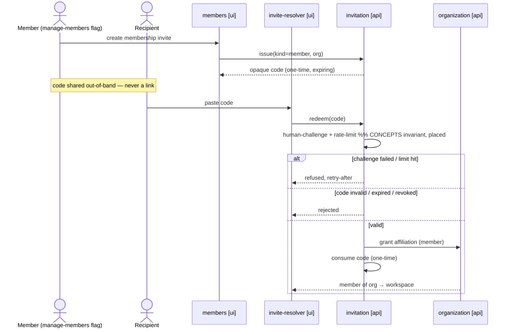

# Flows as spine — sequence-diagram spec layer, experience-sized milestones, compressed stages

**Date:** 2026-06-12
**Status:** designed, awaiting implementation plan

## Problem

Four pains, observed across real projects using the current flow:

1. **Build-stage context overload.** Every `plan`/`build` run re-reads
   `CONCEPTS.md` + `stories.md` + `map.md` + `prototype.md` + surface specs +
   code (~10–15k tokens before any code is read). Agent runs are long even at
   low effort, and details drop near the context tail.
2. **Rework tax across scopes.** Stories cluster around entities (N stories
   around one entity). Building story 1 shapes the entity's code with only
   story 1 in view; story 2 then reworks it — every time. Moving to a new
   scope always means fixing behavior in a previous scope.
3. **Per-milestone stage ceremony.** `milestone-brief → ux-refine → tracer →
   features → plan → build → review → finalize` is too many stages, gates, and
   work files between picking a scope and shipping it (>1 day even for small
   scopes).
4. **Confirmation serialization.** The skill gates on user confirmation at
   nearly every step — a deliberate design, because the spec could not be
   trusted to be conflict-free. The agent almost always finds inconsistent or
   underspecified behavior mid-build and interrupts for a decision.

**Root cause, one sentence:** the behavior spec (prose stories + clickable
prototype) is ambiguous, so trust lives in the user instead of the artifacts —
gates compensate for fuzziness, conflicts surface at build time (the most
expensive place), and the agent reads everything because no compact source of
truth exists.

**Thesis:** move conflict discovery to spec time. A sequence-diagram spec layer
(`flows`) declares every interaction — order, branches, guards (rate-limit,
auth, validation), error paths — before code, at logical altitude. Conflicts
get found while they cost a pencil stroke. Trust moves into the artifact;
gates, context, and rework all shrink as a consequence.

## The new shape

```
Groundwork:    setup → vision → foundation → concepts   (incl. capability dependency map)
Per milestone: brief → flows → realize → (plan → build) × feature → review → finalize
On demand:     prototype, evolve, fix, park, verify, workspace, adopt
```

Removed as stages: `stories` (groundwork), `ux-refine`, `tracer`, `features`,
the groundwork `prototype`. Their responsibilities move as described below.

### Milestone = ready-to-use experience

A milestone is **not** a small scope. It is a complete, business-usable
experience — "organizations can run events end-to-end, with every role's UI" —
however large that is. Nothing inside a milestone needs to be independently
usable; the milestone is the usable unit. Internal order is the feature DAG.
Sizing is by business value, never by effort.

### `concepts` gains the capability dependency map (groundwork)

`docs/CONCEPTS.md` carries, alongside the ubiquitous language, ER
relationships, lifecycles, and invariants, a **capability dependency map**: a
mermaid flowchart of capability areas with solid (hard prerequisite) and
dashed (soft/enhances) edges, plus built/unbuilt marking. This map is the soft
roadmap — the thing milestones are picked off of. (Replaces the whole-product
prototype's roadmap role.)

### `brief` — experience definition + three-layer dependency analysis

The user states the milestone's experience in business terms. The stage then
derives the real scope; unstated dependencies become visible and confirmed
instead of discovered mid-build.

1. **Mechanical closure (script-assisted).** Stated goals name capability
   areas; follow every solid in-edge on the capability map transitively. This
   catches modeled chains (runtime → events → organizations → identity).
2. **Semantic sweep (agent).** Walk `CONCEPTS.md` entity-by-entity for every
   in-scope entity: each relationship, lifecycle rule, and invariant that
   touches it either lands in scope or gets an explicit deferral. This catches
   what the graph cannot: prose-only dependencies (e.g. "sign-in delivers a
   code by email" → notification transport), invariant-implied guards (e.g.
   "redemption is rate-limited"), entity attributes implying capabilities
   (image fields → uploads), roles implying mechanisms ("judges are invited
   per-event" → invitation codes).
3. **Registry backstop (structural, at `flows`).** A sequence diagram cannot
   be completed without naming its participants, and participants must exist
   in the registry — so any dependency that survives layers 1–2 surfaces as a
   missing-participant error at diagram time, not at build time.

If the sweep finds a capability missing from the map (or a new entity), patch
`CONCEPTS.md` first — the existing "new entity → update concepts first" rule.

`brief.md` records: stated goals, pulled-in areas (with the reason each was
pulled), explicit deferrals with waiver notes, and the flow list the milestone
will own. Realizability check: every solid in-edge of every in-scope area is
either built or in this milestone.

User touchpoint #1: confirm the experience boundary (stated + pulled-in +
deferred).

### `flows` — the per-milestone behavior spec (the spine)

Drawn **milestone-up-front**: ALL of the milestone's interactions are declared
before any code. For a large milestone this is days of deliberate work —
that is the point; it replaces the prototype/ux-refine/tracer/features
ceremony and the per-feature interrupt stream.

**Derive the story set; never hand-pick.** For every in-scope entity, walk its
CONCEPTS lifecycle + invariants + relationships: every declared behavior either
gets a flow arrow in this milestone or an explicit waiver. The story list falls
out of the sweep — complete by construction. `project/stories.md` remains the
accumulated backlog index; `flows` appends each milestone's derived set.

**Work area-by-area.** Within the milestone, flows are drawn per capability
area (identity → organizations → events → runtime → outcomes …), each batch
consistency-checked against every previously drawn flow (this milestone's and
all built ones) before the next area starts. Work file
`project/work/m<N>-flows.md` tracks progress across sessions. Sign-off may be
per-area batch.

**Flow file format** — `project/flows/<scenario>.md`, one scenario per file,
global (product truth, accumulated across milestones; `brief.md` lists which
flows a milestone owns):

````markdown
# Flow: invite-redeem

Stories: S-14
Depends on: context-switch

## Diagram


## Rules
Code kinds and one-time/multi-use semantics: CONCEPTS "Invitation code" — not
restated. Redeem is kind-generic: every affiliation kind redeems through this
flow; only the grant target differs.

## Out of scope
notifications on join — waived until the notifications area is in scope
````

Conventions:

- **Logical altitude only.** Participants are concepts (a service, a store, a
  surface) — never a framework, database, or deployment decision. A guard
  ("check rate limit") is behavior, not tech. `foundation`/`realize` still own
  mechanisms — "tech at the latest responsible moment" is preserved.
- **Participants come from the registry** in `project/map.md`
  (`Name | Kind (actor/ui/service/store/external) | Concept ref`) —
  script-enforced; no ad-hoc names, no synonym drift.
- **Reference rules, never restate them.** A CONCEPTS invariant appears on a
  diagram as a placed arrow/guard with a comment pointing home.
- One scenario may realize several stories; a story may span scenarios — IDs
  cross-link both ways (flow header ↔ backlog index).
- `Depends on:` names other flows; feeds the brief realizability check.

**The guarantee — three layers, honest limits.** No process proves a behavior
spec complete; these make every gap an explicit decision and every
inconsistency mechanically detectable:

1. **Consistency by registry (scripted).** Mermaid parses; every participant
   exists in the registry; every flow↔story link resolves both ways; every
   `alt`/`opt` branch terminates in a declared outcome; flow dependencies
   resolve and stay acyclic.
2. **Completeness by concern checklist (agent + user, per flow).** Standard
   sweep before sign-off eligibility: authn, authz, validation, rate-limit,
   error paths, empty/zero states, concurrency/idempotency, audit. Each
   concern either has its arrow or is explicitly waived in `Out of scope`.
   A silent gap becomes impossible — only drawn or waived.
3. **Adversarial verify (read-only subagent, before sign-off).** Attacks the
   flow set: same trigger → contradictory outcomes; participant pairs with
   conflicting contracts; state transitions violating CONCEPTS lifecycles;
   flows consuming what no flow produces. Findings resolved in batch, at
   diagram cost.

Residual risk: something can still slip all three layers — but the failure
mode changes from *silent gap discovered in code* to *visible gap discovered
on a diagram*.

User touchpoint #2: flow sign-off (per-area batches allowed). This sign-off IS
the requirements confirmation for everything downstream — `realize`/`plan`/
`build` run gate-light.

### Entity contracts — the anti-rework mechanism (derived, never stored)

A flow is vertical (one scenario through many participants); rework risk is
horizontal (one entity across many flows). The horizontal view is **computed**:

```bash
adhd-state.mjs contract <participant>
```

scans ALL `project/flows/*.md` (mermaid arrows are parseable data) and emits,
for that participant: every message it receives (its complete interface),
every message it sends (its complete dependencies), guards, and lifecycle
mentions — each with flow + story refs.

- Derived, never stored: flows stay the single source of truth — zero drift,
  always current, no maintenance. ("Every fact has one home.")
- Token-cheap: arrows only.
- Spans all milestones' flows — the cross-milestone memory that keeps
  signatures stable across experience boundaries. CONCEPTS-declared
  relationships shape signatures even before a future area's flows exist
  (e.g. a kind-generic `redeem` because CONCEPTS declares several code kinds).

**Build rule:** implement only the current flow's arrows; design signatures
and schema against the participant's full contract. Story 2 lands in code
already shaped for it.

### `realize` — mechanisms + feature DAG (replaces `tracer` + `features`)

Per milestone, after flow sign-off:

- Pick mechanisms for the milestone's flows; update `docs/STACK.md`, log to
  `docs/DECISIONS.md`. A tracer-style end-to-end spike happens inside this
  stage only when genuinely new infrastructure appears.
- Carve the feature DAG **from diagram segments**, entity-aware: when the
  milestone's flows touch entity X, the first feature for X is shaped from
  X's full contract (schema + interface skeleton sized for all flows);
  per-story features then fill behavior. Skeleton built once, extended N
  times, reworked zero.
- Output: `m<N>/features.md`, same table and parsing as today
  (`ID | Feature | Story | Domain | Repo | Size | Depends on | Build |
  Verified`).

### `plan` / `build` — hard read contract

A feature's context is: its feature row + its flow diagram(s) +
`contract <P>` for every participant it implements + the repo's code.
**Whole-product reads are forbidden** — no wholesale `CONCEPTS.md`,
`stories.md`, or `map.md`. The flow slice IS the context (~1k tokens vs
~10–15k today). `Size: S` skip-plan rule unchanged. Build interrupts the user
ONLY on code-contradicts-diagram (→ `evolve`/`fix`) and at the commit gate.

### `review` — arrow coverage

Per milestone: every arrow in the milestone's flows has an implementation;
every implementation traces to an arrow. Runs per entity too (implemented
arrows vs full contract), so partial implementations are explicit. Findings
needing substantial work become feature rows, as today.

### `prototype` — demoted to on-demand

No longer a groundwork stage or a gate for anything. Run for a milestone
slice when UX is genuinely uncertain; `impeccable` flow unchanged
(`shape → confirm → craft`). `ux-refine` disappears as a stage — its job
(deepen a slice's UX) is this on-demand command. Prototype topology config
stays for projects that use it.

### Artifact changes (duplication audit)

| Fact | Home (new model) |
|---|---|
| Rule/invariant statement | `docs/CONCEPTS.md` (unchanged) |
| Rule's place in an interaction | flow arrow (references, never restates) |
| Capability dependency map | `docs/CONCEPTS.md` |
| Participant/surface existence | `project/map.md` registry |
| Story backlog index | `project/stories.md` — **`Surfaces` column removed** |
| Story ↔ flow link | flow file header |
| Story ↔ surface link | derived (story → flows → ui participants) |
| Surface behavior | derived (`contract <ui-name>`) |
| Surface UX intent | `project/surfaces/<name>.md` — shrinks to a stub (purpose, visual intent, key states) |
| Entity interface across flows | derived (`contract <participant>`) |
| Milestone scope + waivers | `m<N>/brief.md` |
| Mechanisms | `docs/STACK.md` + `docs/DECISIONS.md` (unchanged) |

### Confirmation model

Confirmations concentrate at two points per milestone: the brief boundary and
the flow sign-off. Downstream stages run gate-light because the signed-off
flow set carries the trust the per-stage gates used to compensate for. The
work-file `## Gate` discipline remains for the stages that still have user
touchpoints (`brief`, `flows`); the commit gate is untouched (never commit
without explicit ok). The baseline guard also still applies: `realize` (or any
build task) proposing a stack element not in `docs/STACK.md` stops for the
user's ok — an existing cross-cutting rule, not a new stage gate.

## Script changes (`adhd-state.mjs`)

- New: `contract <participant>` — derived cross-flow view.
- New gates: `flows` (brief exists), `realize` (flows signed off), reshaped
  `next` for the new chain.
- `validate` additions: mermaid parse, registry membership, flow↔story link
  resolution, dangling-branch check, flow-dependency acyclicity.
- `brief` closure helper: parse the capability map's solid edges, compute the
  transitive closure of stated areas (assist, not replace, the semantic sweep).
- `features.md` table parsing unchanged.

## Migration

Two project generations coexist; `config.json` records the generation.
`migrate` does NOT backfill flows — existing prototype/stories artifacts stay
valid; old projects adopt flows incrementally via `evolve` for new work. New
projects get the new chain. Reference docs: new `flows.md`, `realize.md`;
rewritten `milestone-brief.md`, `plan.md`, `build.md`, `review.md`,
`concepts.md` (capability map), `stories.md` (index-only role),
`prototype.md` (on-demand); deleted `ux-refine.md`, `tracer.md`,
`features.md` (stage), groundwork `stories.md` (stage); SKILL.md stage table,
routing, and cross-cutting rules updated.

## Honest costs

- The flows phase for an experience-sized milestone is **days** of spec work
  before code. Deliberate: conflicts are resolved where they cost least.
- Diagram-grade precision is a skill the user must engage with — sign-off
  means actually reading the diagrams.
- An agent can still miss a dependency through all three layers; the design
  guarantees visibility-at-diagram-time, not omniscience.
- Business sign-off on mermaid is weaker than on a clickable prototype — the
  on-demand `prototype` command exists exactly for the slices where that
  matters.

## Out of scope (this redesign)

- Multi-mode (`multi`) repo mechanics, parking lot, `fix`/`park` semantics,
  commit gate, working-memory model — all unchanged except where named above.
  `evolve` keeps its role as the single front door for post-sign-off spec
  changes, but its reference is rewritten to sequence the new living set:
  `concepts → flows` (and registry), instead of `concepts → stories →
  prototype`.
- Auto-generating code or tests from diagrams.
- Any change to `impeccable`/superpowers sub-skill contracts.
