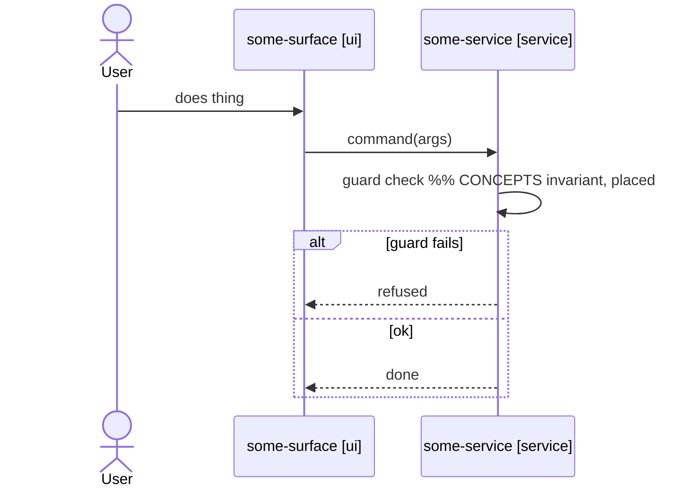

# adhd — Flows

**Effort:** high — for an experience-sized milestone this is days of deliberate spec
work. That is the point: conflicts are resolved here, where they cost a pencil stroke.
**Gate:** `m{{N}}/brief.md` exists.
**Output:** `project/flows/<scenario>.md` (one per scenario), the participant registry
in `project/map.md`, and `m{{N}}/flows.md` (the sign-off doc, written LAST — its
existence is the done signal).
**Sub-skill:** `superpowers:brainstorming`.

`flows` declares ALL of the milestone's interactions as mermaid sequence diagrams
before any code — order, branches, guards (rate-limit, auth, validation), error
paths. The signed-off flow set is the behavior contract every downstream stage reads;
`realize`/`plan`/`build` then run gate-light.

## Gate check
Run `node {{scripts_path}}/adhd-state.mjs gate flows --milestone {{N}}`.
If it reports missing items, HALT. Tell the user exactly which predecessor stage to run.

## Procedure
1. **Start working memory + seed the gate.** Create `project/work/m{{N}}-flows.md`
   with `## Gate` + `## Left to do` + `## Log`. Seed one gate line per capability
   area in the brief (per-area batch sign-off), plus `requirements-confirmed`.
   Confirm the milestone's flow scope/approach with the user, record their verbatim
   ok on `requirements-confirmed`, and check it:
   `node {{scripts_path}}/adhd-state.mjs work-gate flows --milestone {{N}} --item requirements-confirmed`.
2. **Run the CONCEPTS sweep — never hand-pick the flow set.** For every in-scope
   entity, walk its CONCEPTS lifecycle + invariants + relationships: every declared
   behavior either gets a flow arrow in this milestone or an explicit waiver. The
   sweep's output is the flow set plus the waivers — nothing else.
3. **Maintain the participant registry.** Every participant in any diagram must
   exist in `project/map.md`'s registry table:
   `| Participant | Kind | Concept |` with Kind ∈ actor/ui/service/store/external.
   Add participants as flows need them — never invent an undeclared name inline.

   **The flow slug is the stable feature ID** and the code-slice dir name
   (`src/lib/flows/<slug>/`). It is never a sequence number. Renaming a flow is a
   breaking change — route it through `adhd evolve`, never edit the filename casually.
4. **Draw the flows, area by area.** For each capability area in the brief:
   - One scenario per file, `project/flows/<scenario>.md`, format below.
   - **Logical altitude only.** Participants are concepts (a service, a store, a
     surface) — never a framework, database, or deployment decision. A guard
     ("check rate limit") is behavior, not tech.
   - **Reference rules, never restate them.** A CONCEPTS invariant appears as a
     placed arrow/guard with a comment pointing home.
   - **Concern checklist before a flow is sign-off-eligible:** authn, authz,
     validation, rate-limit, error paths, empty/zero states, concurrency/idempotency,
     audit. Each concern either has its arrow or is explicitly waived in
     `## Out of scope`. Drawn or waived — a silent gap is not an option.
   - **`Depends on:` is the canonical inter-flow dependency source.** The feature DAG
     is derived from each flow's `Depends on:` line, so it must be deliberately set:
     a slug list (`Depends on: order-store, submit-order`) or `Depends on: none`. A
     flow that clearly consumes another flow's contract but says `none` is a sign-off
     finding — set it before sign-off.
   - Consistency-check each area batch against every previously drawn flow (this
     milestone's and all built ones) before starting the next area:
     `node {{scripts_path}}/adhd-state.mjs validate`.
5. **Adversarial verify before sign-off.** Dispatch a read-only subagent over the
   full flow set (see reference/verify.md, flow checks): same trigger →
   contradictory outcomes; participant pairs with conflicting contracts; state
   transitions violating CONCEPTS lifecycles; flows consuming what no flow produces.
   Resolve findings with the user in batch. **Mechanical skip:** when the total flow
   set — this milestone's flows plus every previously drawn flow in
   `project/flows/` — is a single flow, skip this step and note the skip in
   `m{{N}}/flows.md`: every check above compares flows against each other, so with
   one flow there is nothing to compare (the CONCEPTS-lifecycle check is already
   covered by the sweep in step 2). Two or more flows anywhere in the set → run it.
6. **Per-area sign-off (user touchpoint #2).** Walk the user through each area's
   diagrams. Record the verbatim ok on that area's gate line;
   `node {{scripts_path}}/adhd-state.mjs work-gate flows --milestone {{N}} --item <area>`
   must pass per area. Sign-off means the user actually read the diagrams.
7. **Write `m{{N}}/flows.md` LAST** — the flow list (final), per-area sign-offs,
   waivers, and every change request and its resolution. Before writing it, run
   `node {{scripts_path}}/adhd-state.mjs work-gate flows --milestone {{N}}` with no
   `--item`: every area line plus `requirements-confirmed` must pass — a fail means
   an area was never actually signed off. Its existence = stage done. This file is
   an **audit record** — nothing downstream parses its body; its job is to preserve
   the verbatim sign-offs before the work file is deleted. Keep it terse.
8. **UI uncertainty?** If a surface's UX is genuinely uncertain, note it in
   `m{{N}}/flows.md` and run the on-demand `adhd prototype` command for that slice —
   it is never a gate.

## Flow file format

````markdown
# Flow: <scenario>

Purpose: <one line — why this scenario exists; optional, human-readable only>
Depends on: <other flow names, or none>

## Diagram


## Rules
Behavior that does not fit an arrow. Reference concepts, never restate.

## Out of scope
<concern> — <waiver reason>
````

Participant ids in arrows are word characters only (`U`, `SVC`); hyphenated
human-readable names belong in the `as` label. The `[kind]` suffix on the label is
required and must match the participant's registry row.

## Quality bar

Part of sign-off eligibility. The concern checklist says *whether* each concern is
covered; this bar says *how well*. A flow failing any check is not
sign-off-eligible, regardless of structure:

- **Arrows are commands/events, never gestures or vague verbs.** Test: could two
  developers implement different behavior from this arrow's text? Then it is too
  vague. `submit order(items)` passes; `interacts with the page`, `handle order`,
  `process` fail.
- **Guards name the condition checked.** `stock available?`, `rate limit exceeded?`
  — never `check things are valid`. The downstream `contract` view is only as
  precise as the arrow text.
- **Waivers carry a real reason.** A waiver explains why the concern is out of scope
  *for this milestone* — "single-tenant milestone, no authn surface yet" — never
  "not needed". Waiving a concern that is obviously load-bearing for the scenario
  (authn on an order submission) additionally requires the user's explicit ok,
  recorded in the waiver line.
- **Registry rows are anchored and sized.** The `Concept` column names a
  `docs/CONCEPTS.md` entity (or the actor) — never `—` or "the system". One
  participant per responsibility: a catch-all `backend` hides every contract the
  `contract` command exists to derive; split it per concept.
- **Surface stubs survive the swap test.** A stub's purpose and UX intent must be
  false for some other surface — "clean and easy to use" describes every surface
  and specifies none.

## Re-running
Flow files are living, global product truth — accumulated across milestones, owned by
none. Post-sign-off changes route through `adhd evolve` (the single front door): the
diagram is corrected first, consistency-checked, then code follows via `fix` or a
feature row.

## On completion
1. `m{{N}}/flows.md` exists; every flow in the brief's `## Flows` list has its file;
   `node {{scripts_path}}/adhd-state.mjs validate` is clean.
2. Drain and delete `project/work/m{{N}}-flows.md`.
3. Tell the user the next runnable stage is `realize`.
